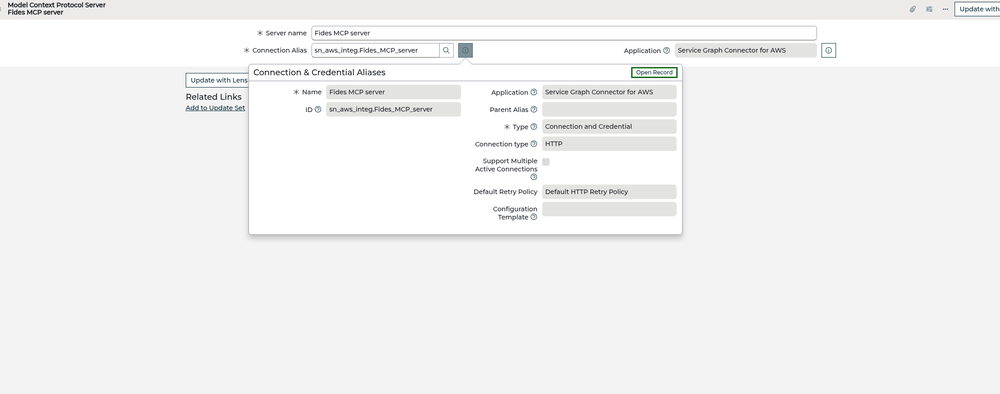
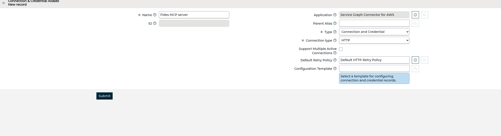
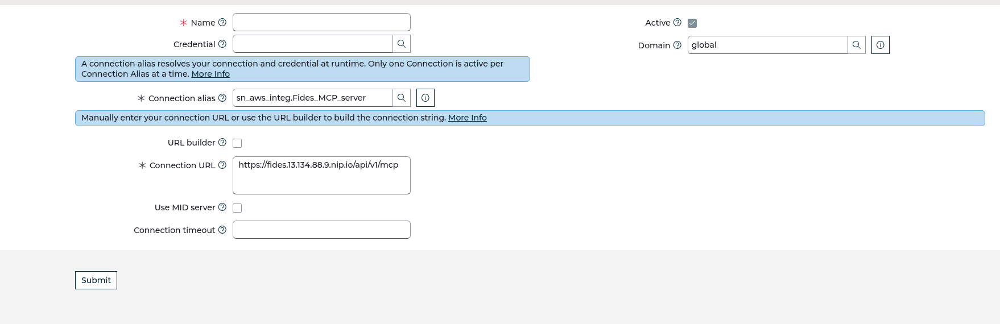
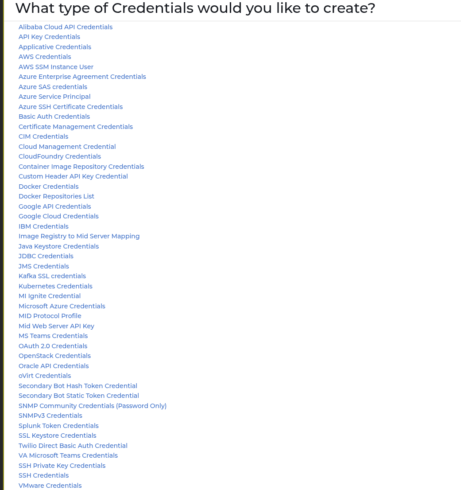
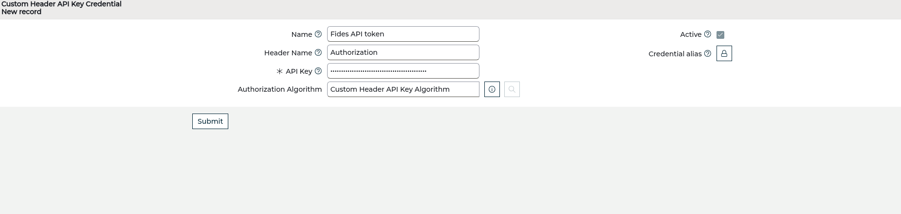
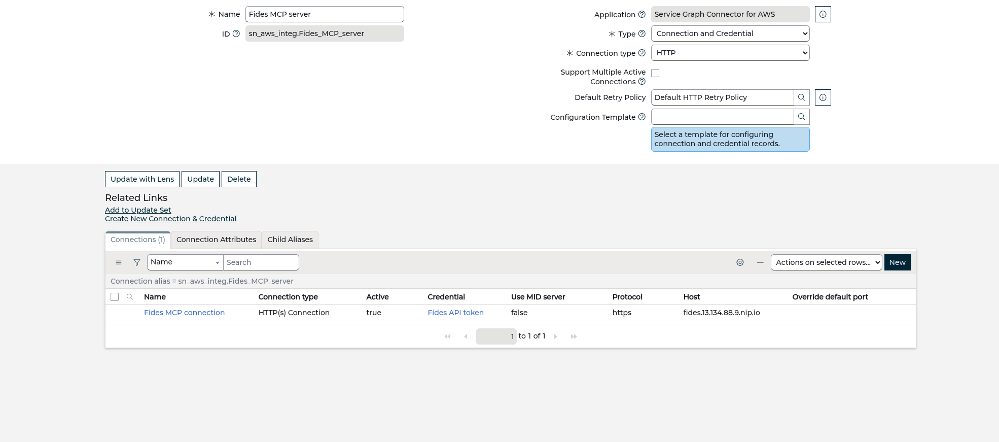

# Onboarding Fides as an MCP server in ServiceNow

> Register the **Fides MCP server** in ServiceNow so **Now Assist** (and AI Agents) can
> call Fides tools — `ground_change` and `get_controls_coverage` — directly.
> **Verified end-to-end** against `calitiiltddemo3.service-now.com` on 2026‑07‑03:
> ServiceNow authenticated to Fides and discovered its tools (`HTTP 200`).
> "Fides advises; ServiceNow decides."

This is the SN→Fides direction (the mirror of [servicenow-mcp.md](servicenow-mcp.md),
where Fides consumes ServiceNow's MCP server). For the grounding endpoint itself, see
[servicenow-now-assist-grounding.md](servicenow-now-assist-grounding.md).

## Prerequisites

- **Fides MCP server is live** at `https://<fides-host>/api/v1/mcp` (the Streamable‑HTTP
  MCP endpoint). Confirm from a shell:
  ```sh
  curl -s -X POST https://<fides-host>/api/v1/mcp \
    -H "Authorization: Bearer $FIDES_API_TOKEN" -H 'Content-Type: application/json' \
    -d '{"jsonrpc":"2.0","id":1,"method":"tools/list","params":{}}' | jq .
  # -> { "result": { "tools": [ "ground_change", "get_controls_coverage" ] } }
  ```
- A **Fides API token** (org‑scoped). You'll paste it into the ServiceNow credential.
- A **ServiceNow admin** with access to *Connections & Credentials* and the *MCP Server* app.
- ServiceNow must be able to reach the Fides host over HTTPS (no MID server needed if the
  host is publicly reachable).

## Overview — the record chain

```
sn_mcp_server "Fides MCP server"
      └── Connection Alias  →  sn_alias  (Type: Connection and Credential, HTTP)
                                   ├── HTTP Connection  →  URL /api/v1/mcp
                                   └── Credential       →  Custom Header API Key (Authorization: Bearer <token>)
```

---

## Step 1 — Register the MCP server

Open the **Model Context Protocol Servers** list (`sn_mcp_server`) — navigate to
`/sn_mcp_server_list.do` or the **MCP Server** app — and click **New**.

- **Server name:** `Fides MCP server`
- **Connection Alias:** create a new one in Step 2 (the field is a reference; use its
  magnifier → *New*, or create the alias first and select it here).



---

## Step 2 — Create the Connection & Credential Alias

On the alias form (opened from the Connection Alias field's *New*):

- **Name:** `Fides MCP server`
- **Type:** `Connection and Credential`
- **Connection type:** `HTTP`

Leave the rest default and **Submit**.



The alias reopens with a **Connections** related list. Add the connection next.

---

## Step 3 — Add the HTTP Connection

On the alias, **Connections → New**:

- **Name:** `Fides MCP connection`
- **Connection URL:** `https://<fides-host>/api/v1/mcp`
- **Use MID server:** off
- **Active:** on

**Submit.**



> Ignore any *"There is no configuration template to create connections and credential
> records"* banner — that's only from the guided *Create New Connection & Credential*
> link, which needs a template. Adding the connection directly (as above) is the path.

---

## Step 4 — Add the Credential (the Bearer token)

Fides authenticates with `Authorization: Bearer <token>`. The credential type that sends
an exact custom header is **`Custom Header API Key Credential`**.

From the connection's **Credential** field magnifier → **New** → pick
**Custom Header API Key Credential**:



Fill it:

- **Name:** `Fides API token`
- **Header Name:** `Authorization`
- **API Key:** type `Bearer ` (with a trailing space), then paste the Fides token, so the
  value reads exactly:
  ```
  Bearer <your-fides-api-token>
  ```
- **Authorization Algorithm:** `Custom Header API Key Algorithm` (default)

**Submit.**



> ⚠️ **The `Bearer ` prefix is mandatory.** The Custom‑Header type sends the header
> verbatim as `Authorization: <API Key>`. Without the `Bearer ` prefix Fides returns
> **401** and ServiceNow's tool call fails silently.

---

## Step 5 — Link the credential to the connection

Open **Fides MCP connection** again and set its **Credential** field to **`Fides API token`**
(type it and pick from the dropdown), then **Update**.

The connection should now show **Active: true**, **Credential: Fides API token**,
**Host: `<fides-host>`**, **Protocol: https**:



That completes the chain: **alias → connection (URL) → credential (Bearer token)**.

> The credential's own *Credential alias* list field can be left empty — its reference
> qualifier may not match this alias, and it isn't needed. The **connection → credential**
> link (above) is what the alias resolves at runtime.

---

## Step 6 — Verify (ServiceNow → Fides)

Force ServiceNow to connect to Fides and list its tools. With the `sn_mcp_server` record's
`sys_id`:

```sh
curl -s -u "$SN_USER:$SN_PASS" \
  "https://<instance>.service-now.com/api/sn_wdf_mcp_client/mcp/servers/<sn_mcp_server_sys_id>/tools" | jq .
```

A successful response (`HTTP 200`) returns Fides's tools — proof the connection **and the
Bearer auth** work end‑to‑end:

```json
{ "result": { "tools": [
  { "name": "get_controls_coverage", "description": "List the org's governance controls …" },
  { "name": "ground_change", "description": "Ground Now Assist for a ServiceNow change …" }
] } }
```

If you get **401** → the credential is missing the `Bearer ` prefix or the wrong header.
If you get **no records / not found** → re‑check the connection is *Active* and its
Credential is set.

---

## Step 7 — Make it callable by Now Assist (AI Agent Studio)

> **Role required:** AI Agent Studio needs the **`sn_aia.admin`** role. With only
> `sn_aia.viewer` you'll see a *"Read-only"* banner and *Create and manage* is disabled.
> Have an admin grant `sn_aia.admin` first (System Administration → Users → *your user* →
> Roles → add `sn_aia.admin`). Now Assist / Generative AI Controller must also be
> activated on the instance.

Tool **discovery** works after Step 6; **invocation** needs the tools *synced* into the
tool registry — which AI Agent Studio does when you attach the server to an agent:

1. Open **AI Agent Studio** — the reliable way is the **All** menu (top‑left) → type
   `AI Agent Studio` → open it. (There's no stable direct URL; it's a UXF app shell.
   The Now Assist **Skill Kit** at `/now/now-assist-skillkit/` is the adjacent surface.)
2. Create/open a **change‑management agent** → **Add tools → From MCP server → Fides MCP server**.
   Selecting it **syncs the tools** and exposes **`ground_change`** to the agent.
3. Instruct the agent to call `ground_change` with the change number and base every
   compliance statement on the returned `grounding_summary` (and to say *"compliance
   UNVERIFIED by Fides"* when `grounded: false`).

Now Assist can then answer *"is CHG… safe to approve?"* from Fides's tamper‑evident
control‑coverage + risk, instead of guessing.

---

## Troubleshooting (pitfalls we hit)

| Symptom | Cause | Fix |
|---|---|---|
| Tool call returns **401** | API Key missing the `Bearer ` prefix, or wrong header name | API Key = `Bearer <token>`, Header Name = `Authorization` |
| Credential **alias** field shows *Invalid reference* | Its reference qualifier doesn't match this alias; no type‑ahead match | Leave it empty — link from the **connection → Credential** side instead |
| *"No configuration template"* banner | Clicked the guided *Create New Connection & Credential* link | Ignore it; add the Connection + Credential directly from the alias's related lists |
| Invoke returns *"No sync record found"* | Tools discovered but not yet **synced** into the registry | Attach the server to an agent in AI Agent Studio (Step 7) — that syncs the tools |

## Related
- [servicenow-mcp.md](servicenow-mcp.md) — Fides consuming ServiceNow's MCP server.
- [servicenow-now-assist-grounding.md](servicenow-now-assist-grounding.md) — the grounding endpoint + `ground_change`.
- [servicenow-integration.md](servicenow-integration.md) — change‑gate write‑back, control linkage, CMDB anchoring.
