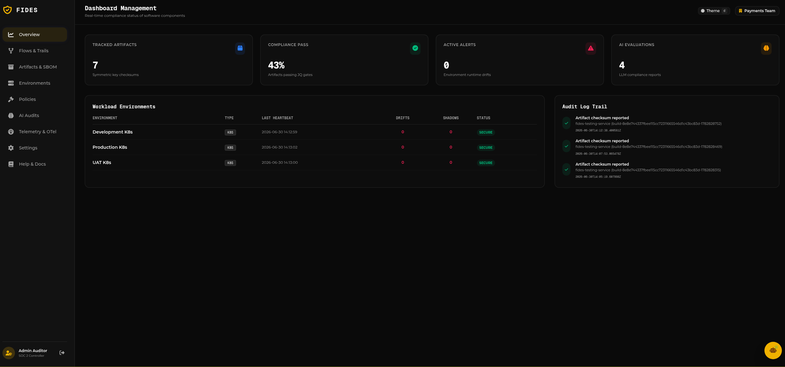
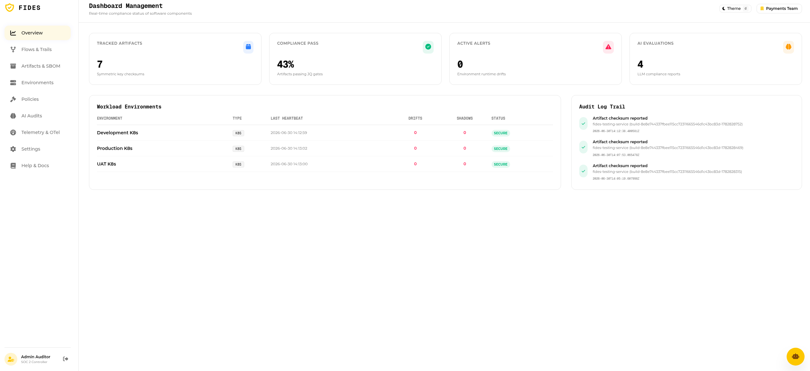
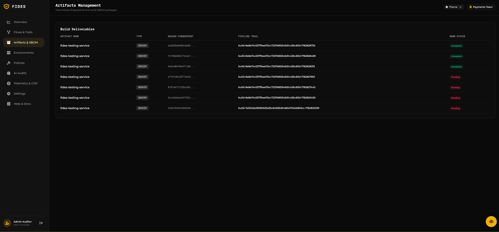
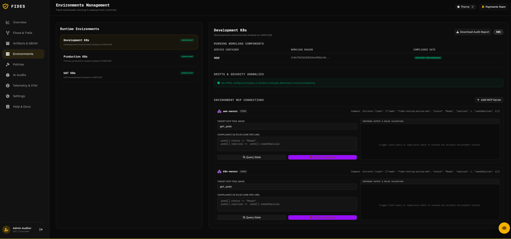
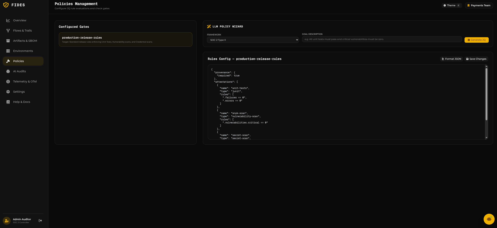
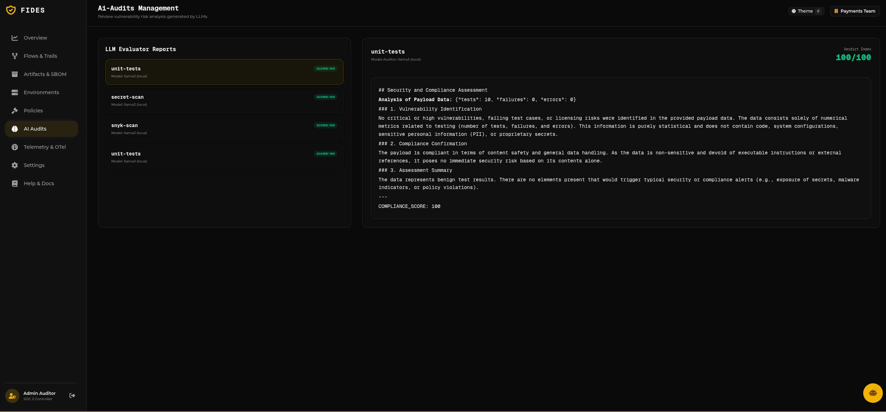
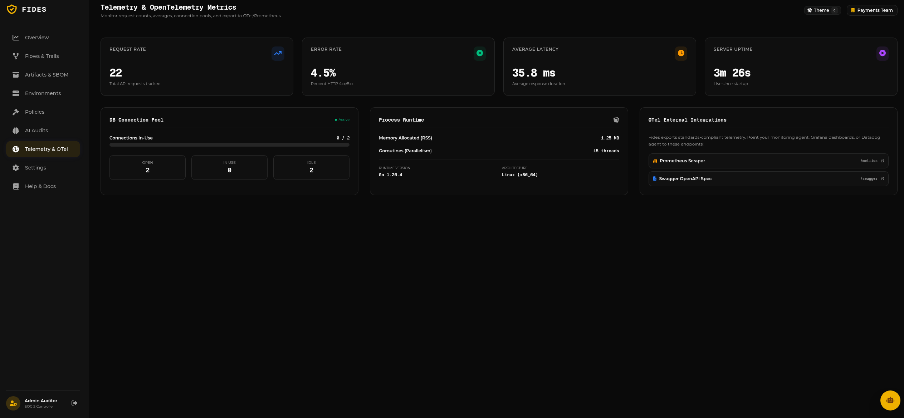
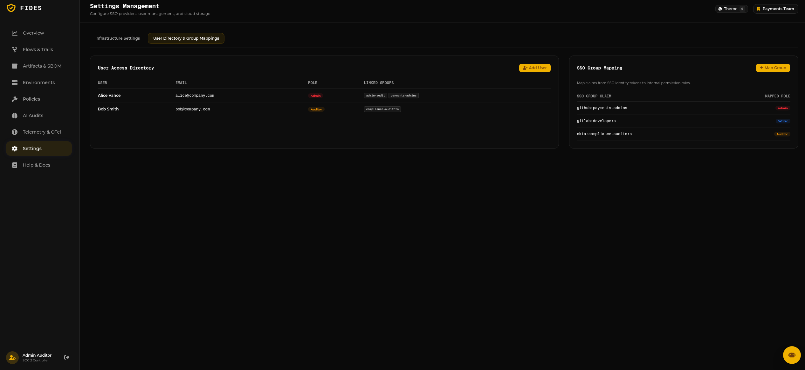
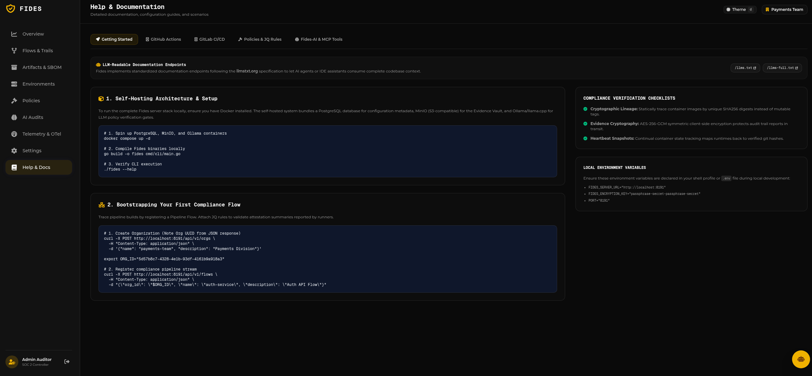

# Fides: Trust, Provenance & Evidence Tracking System

Fides is a self-hosted, multi-cloud compatible compliance tracking system. It records and evaluates every state change in the software delivery lifecycle (SDLC) in real-time, acting as an audit-ready single source of truth to satisfy strict compliance frameworks such as SOC 2, ISO 27001, and FDA 21 CFR Part 11.

> [!TIP]
> Check out the comprehensive **[Fides Integration & Setup Guide](/guide.html)** for detailed walkthroughs, CI/CD templates, database setups, secret vaults, and AI-audits.

---

## 1. Architectural Blueprint & Overview

Fides tracks and validates software deliverables from source code commits to running environments, establishing a secure, verifiable software supply chain.

### Core Modules

* **Fides CLI (`fides`)**: Statically compiled cross-platform CLI tool that runs in CI/CD runners or server hosts.
* **Fides Core API Server**: Orchestrates data models, manages vaults and storage systems, and evaluates policy rules.
* **LLM Verification Gateway (`Fides-AI`)**: Leverages natural language models (Ollama, llama.cpp, Google Gemini) to check licenses, scan for credentials, and assess compliance risks.
* **Management Web Portal**: React dashboard for configuring environments, policies, and viewing compliance states.
* **Model Context Protocol (MCP) Server (`fides-mcp`)**: Exposes compliance data as tools **and the Fides docs as resources** to AI clients like **Claude Code**, Cursor, and Claude Desktop. See the [MCP server guide](/mcp-server.html).

---

## 2. Supply Chain Provenance & The Flow Engine

The Fides Flow Engine tracks software deliverables through logical streams called **Flows** and execution runs called **Trails**.

<pre class="mermaid">
graph TD
    subgraph CI ["CI/CD Pipeline (GitHub/GitLab)"]
        A[Git Push/PR] --> B[fides trail start]
        B --> C[Build Container Image]
        C --> D[fides artifact report]
        D --> E[Run Vulnerability Scans]
        E --> F[fides attest --encrypt]
        F --> G[fides assert --policy]
    end

    subgraph VAULT ["Evidence Vault & Storage"]
        H[(AWS S3 / GCS)]
    end

    subgraph DB ["Metadata Registry"]
        I[(PostgreSQL Database)]
    end

    subgraph CORE ["Fides Control Plane"]
        J[Fides Core Server]
        K[Fides-AI LLM Gateway]
    end

    G -->|HTTPS Request| J
    J -->|Saves Audit Metadata| I
    J -->|Uploads Encrypted Raw Scans| H
    J -->|Reviews Logs & Risks| K
</pre>

---

## 3. The Decision Engine & JQ Policies

The Decision Engine evaluates reported attestations against policies using deterministic JQ filters. If any filter evaluates to `false`, the assertion gate triggers an exit code 1 to abort the build/deployment.

### Decision Engine Flow

<pre class="mermaid">
graph TD
    Start([Assert Request]) --> GetPolicy[Resolve Policy Rules]
    GetPolicy --> FetchAttestations[Fetch Attestations for Artifact SHA256]
    FetchAttestations --> LoopStart{For each Rule in Policy}
    
    LoopStart -->|Next Rule| MatchType{Attestation Type Matches?}
    MatchType -->|No| SkipRule[Skip Rule] --> LoopStart
    MatchType -->|Yes| EvalJQ[Evaluate JQ Expression on Payload]
    
    EvalJQ --> IsCompliant{Evaluates to True?}
    IsCompliant -->|Yes| RecordPass[Record Rule Pass] --> LoopStart
    IsCompliant -->|No| RecordFail[Record Rule Failure] --> LoopStart
    
    LoopStart -->|All Rules Evaluated| FinalCheck{Any Failures Recorded?}
    FinalCheck -->|Yes| FailGate[Exit Code 1: Abort Deployment]
    FinalCheck -->|No| PassGate[Exit Code 0: Allow Deployment]
</pre>

### Sample Policy Configuration

```json
{
  "provenance": {
    "required": true
  },
  "attestations": [
    {
      "name": "unit-tests",
      "type": "junit",
      "rules": [
        ".failures == 0",
        ".errors == 0"
      ]
    },
    {
      "name": "snyk-scan",
      "type": "vulnerability-scan",
      "rules": [
        ".vulnerabilities.critical == 0"
      ]
    },
    {
      "name": "secret-scan",
      "type": "secret-scan",
      "rules": [
        ".leaks == 0"
      ]
    }
  ]
}
```

---

## 4. Shadow & Drift Control Loop

To prevent unauthorized configuration modifications and ensure active runtimes correspond with verified provenance registries, environment snapshots are tracked continuously.

<pre class="mermaid">
graph TD
    subgraph EKS ["Production Kubernetes Cluster"]
        A[Running Containers & Pods]
        B[Unregistered Container / Shadow Deployment]
    end

    subgraph DEVEN ["Fides Environment Daemon"]
        C[fides snapshot k8s]
    end

    subgraph CORE ["Fides Control Plane"]
        D[Fides Core Server]
        E[(PostgreSQL Registry)]
        F[Drift Detection Engine]
    end

    A -->|Snapshot State| C
    B -->|Snapshot State| C
    C -->|Secure State Report| D
    D -->|Compare Runtime Digests| F
    F -->|Query Provenance SHA256| E
    F -->|Mismatch Found| G[Alert: Shadow Container Detected]
    F -->|Attestation Fails Post-Deploy| H[Alert: Configuration Drift Detected]
</pre>

---

## 5. Security Architecture & End-to-End Cryptography

Evidence payloads reported by runners are symmetrically encrypted before transit using **AES-256-GCM** to ensure absolute confidentiality in transit. The server decrypts them upon receipt using keys stored in the Vault.

<pre class="mermaid">
graph TD
    subgraph CI ["CI/CD Runner (Source Zone)"]
        A[Raw Security Scan JSON]
        B[Key Derivation: PBKDF2]
        C[Symmetric Key]
        D[AES-256-GCM Encrypter]
        E[Encrypted Ciphertext]
    end

    subgraph TRANSIT ["Transit Zone"]
        F[HTTPS Network Request]
    end

    subgraph SERVER ["Fides Core API Server (Destination Zone)"]
        G[Fides Core Server]
        H[Decryption Engine]
        I[PostgreSQL Database]
    end

    B -->|Generates| C
    A -->|Input| D
    C -->|Input| D
    D -->|Generates| E
    E -->|Sent via| F
    F -->|Received by| G
    G -->|Invokes| H
    H -->|Saves Decrypted Payload| I
</pre>

---

## 6. Built-in MCP Server (`fides-mcp`)

Fides includes a built-in **Model Context Protocol (MCP)** server enabling AI tools to inspect and interact with the compliance registry.

### Supported Tools

* `list_flows`: Fetch compliance pipelines.
* `list_environments`: Retrieve runtime snapshots and configuration drifts.
* `list_policies`: Fetch JQ rules.
* `check_compliance`: Run rule evaluation against artifact SHA256s.
* `create_flow`: Programmatically register pipeline flows.


## 7. Regulated Compliance & Governance

Fides maps evidence to the controls of the frameworks regulated enterprises answer to, and turns that mapping into an actionable change decision.

* **Framework catalogs** — adopt SOC 2, ISO 27001, NIST 800-53, PCI-DSS, DORA, PSD2, or SOX in one command (`fides control import --framework`). Each control declares the evidence types it requires.
* **Change gate + risk** — `fides change-gate --trail <id>` returns an approve/hold verdict and a 0–100 risk score computed from which controls pass, fail, or lack evidence. The same verdict + risk is written back onto the matching **ServiceNow Change Request** (work note + risk field) — Fides is the evidence layer; ServiceNow remains the system of record.
* **Segregation of duties** — approvals are first-class evidence (`fides approve`), distinguishing a human sign-off from machine automation. The gate will not recommend approval without a human review, and four-eyes requires two distinct human approvers.
* **Audit-ready reports** — `fides report --framework <name>` produces a control-by-control report (evidence satisfied + environment coverage) for auditors.
* **Tenant isolation (RLS)** — Postgres Row-Level Security enforces per-tenant isolation at the database layer, independent of application WHERE clauses (`FIDES_RLS_ENABLED`).
* **WORM retention** — optional S3 Object Lock keeps evidence immutable for a fixed window (`FIDES_OBJECT_LOCK_MODE`, `FIDES_EVIDENCE_RETENTION_DAYS`).

Git coverage spans **GitHub, GitLab, Bitbucket, and Azure DevOps**. Install with the Helm chart (`charts/fides`) or `scripts/setup-db.sh` — see [Setup & Seeding](setup.md) and the [CLI Reference](cli-reference.md).


## Web Portal Tour

Fides features a premium, state-of-the-art web portal for security auditors and DevSecOps controllers. Below is a tour of the portal pages:

### 1. Overview Dashboard (Dark & Light Modes)
The dashboard provides a real-time summary of compliance parameters (Tracked Artifacts, Compliance Pass Rate, Active Alerts, and AI Evaluations) alongside workload environment status and audit logs.
- **Dark Mode:**
  
- **Light Mode:**
  

### 2. Artifacts & SBOM Management
Trace built software deliverables and verify SBOM package compatibility. Compliant builds show packages, licenses, and vulnerabilities, while pending builds indicate scans in progress.


### 3. Environments & MCP Connections
Monitor active deployment environments (EKS, ECS, etc.) and configure Model Context Protocol (MCP) sensors (e.g. `k8s-sensor`) to query and verify compliance rules directly.


### 4. Policies & JQ Rule Configurator
Configure deterministic compliance gates using JQ rules or let the **LLM Policy Wizard** automatically generate rule configurations based on text-described goals.


### 5. AI Audits & LLM Evaluator Reports
Review deep risk and compliance assessments generated asynchronously by local or cloud LLMs for every reported attestation.


### 6. Telemetry & OpenTelemetry Metrics
Gain observability into the Fides API backend, request rates, error rates, DB connection pools, and export data directly to Prometheus `/metrics` or OpenTelemetry scrapers.


### 7. Settings & SSO Group Mappings
Manage local directories, SSO group mappings (e.g. GitHub teams, Okta group claims), and define roles.


### 8. Help & Documentation Center
A built-in help center providing code templates, CLI usage instructions, and links to `/llms.txt` and `/llms-full.txt` standard context endpoints.



---

## 8. Feature Reference & CLI

For the capabilities added across recent releases — built-in evidence parsers,
tamper-evident attestation chains, service accounts with rotatable keys,
per-environment allow-lists, environment policies with tags, search & snapshot
diff, audit packages, ECS/Lambda snapshots, logical environments, DORA metrics,
and Slack notifications — see:

* **[Feature guide with real examples](/docs/features.md)**
* **[Full CLI reference](/docs/cli-reference.md)**
* **[ServiceNow integration](/docs/servicenow-integration.md)** (admin page at `/servicenow`)
