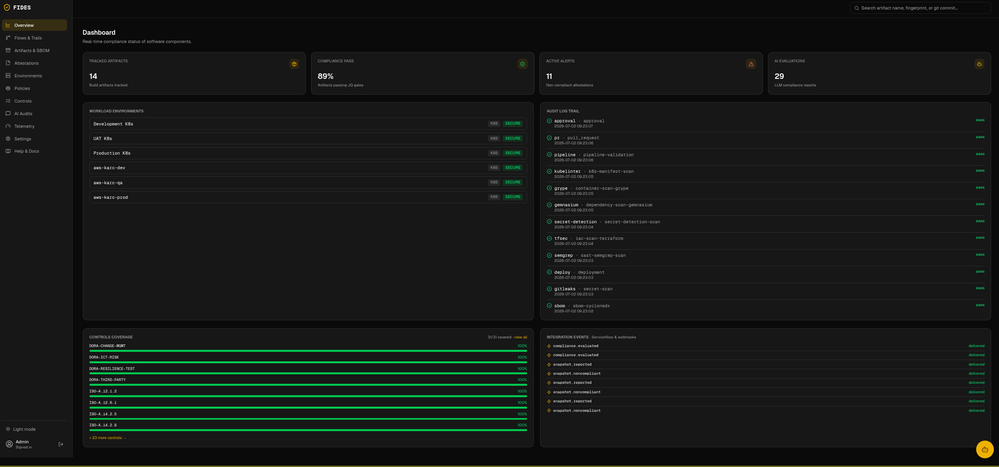
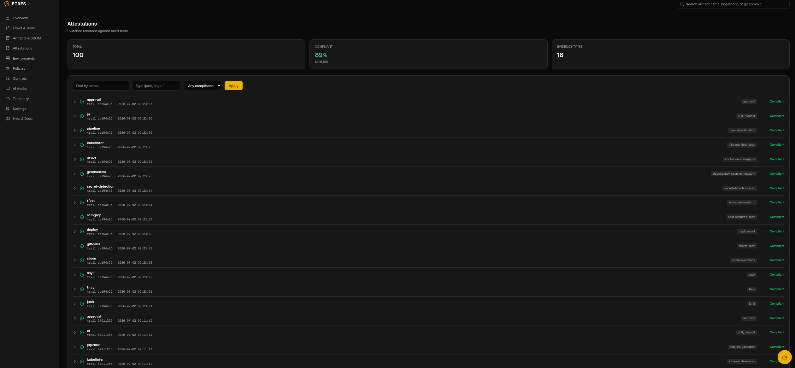
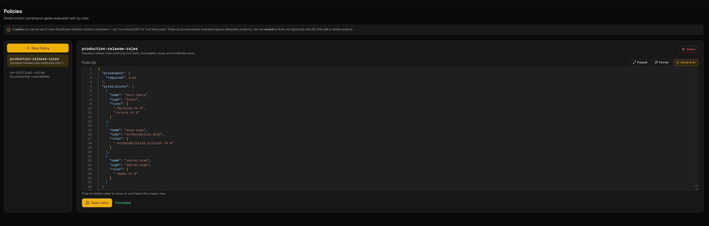
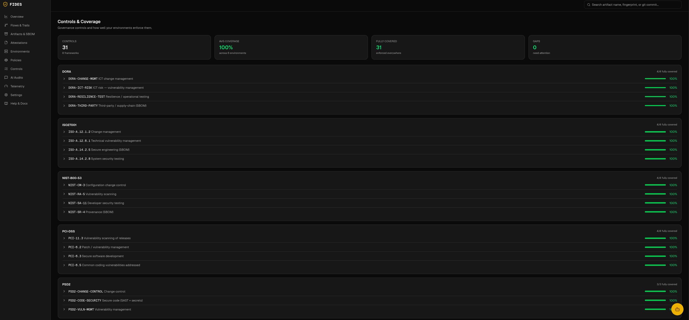
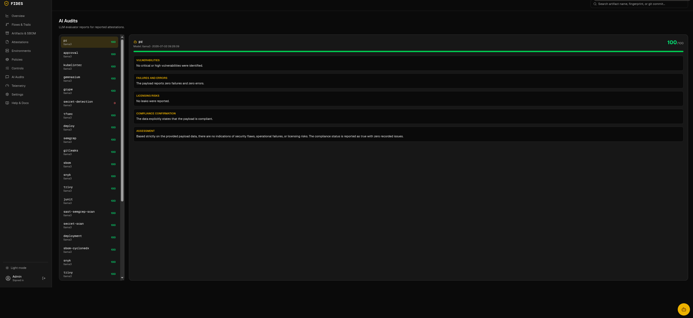
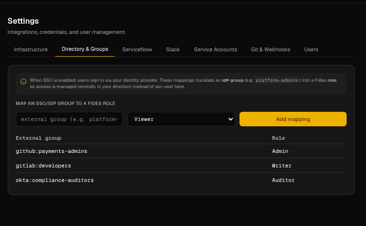
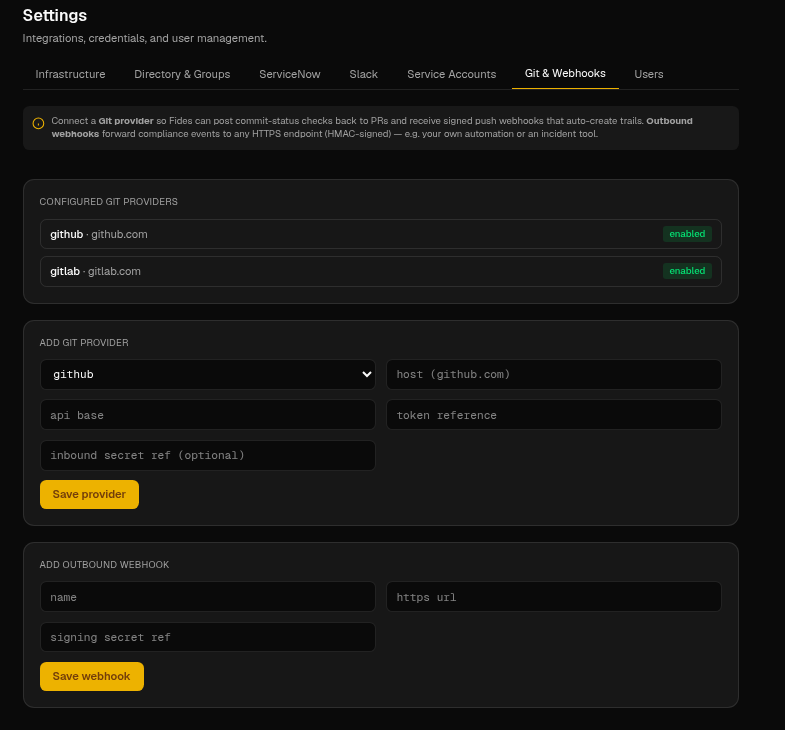

# Fides: Trust, Provenance & Evidence Tracking System

Fides is a self-hosted, multi-cloud compatible compliance tracking system. It records and evaluates every state change in the software delivery lifecycle (SDLC) in real-time, acting as an audit-ready single source of truth to satisfy strict compliance frameworks such as SOC 2, ISO 27001, and FDA 21 CFR Part 11.

> [!TIP]
> Ready to install? See the **[Installation guide](/installation.html)** — release
> binaries, the Nix flake, and the `services.fides` NixOS module. For deep-dive
> walkthroughs, CI/CD templates, database setups, secret vaults, and AI-audits,
> read the **[Fides Integration & Setup Guide](/guide.html)**.

---

## 1. Architectural Blueprint & Overview

Fides tracks and validates software deliverables from source code commits to running environments, establishing a secure, verifiable software supply chain.

### Core Modules

* **Fides CLI (`fides`)**: Statically compiled cross-platform CLI tool that runs in CI/CD runners or server hosts. Commands span `trail`/`artifact`/`attest`, `verify-chain`, `assert`, `change-gate`, `allowlist`, `control import|coverage|enforce`, `report`, and `metrics`.
* **Fides Core API Server**: Orchestrates data models, manages vaults and storage systems, evaluates policy rules, and serves the portal, the governance APIs, and the AI endpoints (e.g. `POST /api/v1/ai/lint-policy`).
* **LLM Verification Gateway (`Fides-AI`)**: Leverages natural language models (Ollama, llama.cpp, Google Gemini) to check licenses, scan for credentials, assess compliance risks, and power the portal's "Check & fix" policy linter and scored AI audit reports.
* **Management Web Portal**: Next.js static export served by the Go server — clickable dashboard KPI cards, redesigned Controls & Coverage, a Monaco policy editor, SBOM/attestation drill-down, AI audits, telemetry charts, and a voice-enabled AI Assistant.
* **Model Context Protocol (MCP) Server (`fides-mcp`)**: Exposes compliance data as **15 tools** **and the Fides docs as resources** to AI clients like **Claude Code**, Cursor, and Claude Desktop. See the [MCP server guide](/mcp-server.html).
* **In-browser WebMCP**: The portal registers Fides tools directly in the browser via the native `document.modelContext` API (with the `@mcp-b/global` polyfill fallback), so browser agents and local LLMs can drive Fides from the same session the auditor is using.

### High-Level Architecture

<pre class="mermaid">
graph TD
    subgraph CLIENTS ["Producers & Clients"]
        CLI[Fides CLI]
        CI[CI/CD Pipeline<br/>GitHub / GitLab]
        AITOOLS[AI Clients<br/>Claude Code / Cursor]
        BROWSER[Browser Agents<br/>& Local LLMs]
    end

    subgraph FIDES ["Fides Control Plane"]
        API[Fides Core API Server]
        AI[Fides-AI LLM Gateway]
        MCP[fides-mcp Server]
        PORTAL[Web Portal<br/>+ In-browser WebMCP]
    end

    subgraph DATA ["State & Evidence"]
        PG[(PostgreSQL<br/>RLS + WORM metadata)]
        OBJ[(Object Store<br/>S3 / GCS)]
    end

    subgraph SINKS ["Integration Sinks"]
        SNOW[ServiceNow<br/>change-gate write-back]
        SLACK[Slack]
        GIT[GitHub / GitLab<br/>commit-status]
        HOOKS[Webhooks]
    end

    CLI --> API
    CI --> CLI
    AITOOLS --> MCP
    MCP --> API
    BROWSER --> PORTAL
    PORTAL --> API
    API --> AI
    API --> PG
    API --> OBJ
    API --> SNOW
    API --> SLACK
    API --> GIT
    API --> HOOKS
</pre>

---

## 2. Supply Chain Provenance & The Flow Engine

The Fides Flow Engine tracks software deliverables through logical streams called **Flows** and execution runs called **Trails**.

<pre class="mermaid">
graph TD
    subgraph CI ["CI/CD Pipeline (GitHub/GitLab)"]
        A[Git Push/PR] --> B[fides trail start]
        B --> C[Build Container Image]
        C --> D[fides artifact report]
        D --> E[Run Vulnerability Scans]
        E --> F[fides attest --encrypt]
        F --> G[fides assert --policy]
    end

    subgraph VAULT ["Evidence Vault & Storage"]
        H[(AWS S3 / GCS)]
    end

    subgraph DB ["Metadata Registry"]
        I[(PostgreSQL Database)]
    end

    subgraph CORE ["Fides Control Plane"]
        J[Fides Core Server]
        K[Fides-AI LLM Gateway]
    end

    G -->|HTTPS Request| J
    J -->|Saves Audit Metadata| I
    J -->|Uploads Encrypted Raw Scans| H
    J -->|Reviews Logs & Risks| K
</pre>

---

## 3. The Decision Engine & JQ Policies

The Decision Engine evaluates reported attestations against policies using deterministic JQ filters. If any filter evaluates to `false`, the assertion gate triggers an exit code 1 to abort the build/deployment.

### Decision Engine Flow

<pre class="mermaid">
graph TD
    Start([Assert Request]) --> GetPolicy[Resolve Policy Rules]
    GetPolicy --> FetchAttestations[Fetch Attestations for Artifact SHA256]
    FetchAttestations --> LoopStart{For each Rule in Policy}
    
    LoopStart -->|Next Rule| MatchType{Attestation Type Matches?}
    MatchType -->|No| SkipRule[Skip Rule] --> LoopStart
    MatchType -->|Yes| EvalJQ[Evaluate JQ Expression on Payload]
    
    EvalJQ --> IsCompliant{Evaluates to True?}
    IsCompliant -->|Yes| RecordPass[Record Rule Pass] --> LoopStart
    IsCompliant -->|No| RecordFail[Record Rule Failure] --> LoopStart
    
    LoopStart -->|All Rules Evaluated| FinalCheck{Any Failures Recorded?}
    FinalCheck -->|Yes| FailGate[Exit Code 1: Abort Deployment]
    FinalCheck -->|No| PassGate[Exit Code 0: Allow Deployment]
</pre>

### Sample Policy Configuration

```json
{
  "provenance": {
    "required": true
  },
  "attestations": [
    {
      "name": "unit-tests",
      "type": "junit",
      "rules": [
        ".failures == 0",
        ".errors == 0"
      ]
    },
    {
      "name": "snyk-scan",
      "type": "vulnerability-scan",
      "rules": [
        ".vulnerabilities.critical == 0"
      ]
    },
    {
      "name": "secret-scan",
      "type": "secret-scan",
      "rules": [
        ".leaks == 0"
      ]
    }
  ]
}
```

---

## 4. Shadow & Drift Control Loop

To prevent unauthorized configuration modifications and ensure active runtimes correspond with verified provenance registries, environment snapshots are tracked continuously.

<pre class="mermaid">
graph TD
    subgraph EKS ["Production Kubernetes Cluster"]
        A[Running Containers & Pods]
        B[Unregistered Container / Shadow Deployment]
    end

    subgraph DEVEN ["Fides Environment Daemon"]
        C[fides snapshot k8s]
    end

    subgraph CORE ["Fides Control Plane"]
        D[Fides Core Server]
        E[(PostgreSQL Registry)]
        F[Drift Detection Engine]
    end

    A -->|Snapshot State| C
    B -->|Snapshot State| C
    C -->|Secure State Report| D
    D -->|Compare Runtime Digests| F
    F -->|Query Provenance SHA256| E
    F -->|Mismatch Found| G[Alert: Shadow Container Detected]
    F -->|Attestation Fails Post-Deploy| H[Alert: Configuration Drift Detected]
</pre>

---

## 5. Security Architecture & End-to-End Cryptography

Evidence payloads reported by runners are symmetrically encrypted before transit using **AES-256-GCM** to ensure absolute confidentiality in transit. The server decrypts them upon receipt using keys stored in the Vault.

<pre class="mermaid">
graph TD
    subgraph CI ["CI/CD Runner (Source Zone)"]
        A[Raw Security Scan JSON]
        B[Key Derivation: PBKDF2]
        C[Symmetric Key]
        D[AES-256-GCM Encrypter]
        E[Encrypted Ciphertext]
    end

    subgraph TRANSIT ["Transit Zone"]
        F[HTTPS Network Request]
    end

    subgraph SERVER ["Fides Core API Server (Destination Zone)"]
        G[Fides Core Server]
        H[Decryption Engine]
        I[PostgreSQL Database]
    end

    B -->|Generates| C
    A -->|Input| D
    C -->|Input| D
    D -->|Generates| E
    E -->|Sent via| F
    F -->|Received by| G
    G -->|Invokes| H
    H -->|Saves Decrypted Payload| I
</pre>

---

## 6. Built-in MCP Server (`fides-mcp`)

Fides includes a built-in **Model Context Protocol (MCP)** server (`fides-mcp`) exposing **15 tools** plus the Fides docs as MCP resources (`fides://docs/*`), enabling AI tools to inspect and interact with the compliance registry.

### Supported Tools (selection)

* `list_flows` / `list_environments` / `list_policies`: Fetch pipelines, runtime snapshots, and JQ rules.
* `check_compliance`: Run rule evaluation against artifact SHA256s.
* `search_artifacts` / `search_attestations`: Query evidence and signed attestations.
* `get_controls_coverage`: Report control coverage across frameworks.
* `get_deployment_frequency`: DORA deployment-frequency metrics.
* ServiceNow + provenance-recording tools for change-gate write-back and trail capture.

### Two ways AI drives Fides

* **`fides-mcp` (out-of-browser)** — shipped in the image at `/usr/local/bin/fides-mcp` for Claude Code, Cursor, and Claude Desktop.
* **In-browser WebMCP** — the portal registers the same Fides tools via the native `document.modelContext` API (with the `@mcp-b/global` polyfill fallback), so browser agents and local LLMs can act inside the auditor's authenticated session.


### Downloadable Agent Skill (Claude Code & other agents)

Fides ships a portable **Agent Skill** that teaches Claude Code (and other AI agents)
how to drive Fides — **every CLI command, all configuration, management, and CI/CD
pipeline actions**. It's plain Markdown (a `SKILL.md` plus reference files), no
dependencies.

**Download:** [`.zip`](https://github.com/olafkfreund/fides/releases/download/fides-skill-v1.0.0/fides-skill-v1.0.0.zip) ·
[`.tar.gz`](https://github.com/olafkfreund/fides/releases/download/fides-skill-v1.0.0/fides-skill-v1.0.0.tar.gz) ·
[all releases](https://github.com/olafkfreund/fides/releases)

```sh
# one-liner: download, extract, install for your user (all projects)
curl -sSL https://github.com/olafkfreund/fides/releases/download/fides-skill-v1.0.0/fides-skill-v1.0.0.tar.gz \
  | tar -xz && ./fides-skill-v1.0.0/install.sh
#   ./install.sh --project   installs into ./.claude/skills/fides instead
```

Then ask Claude Code about `fides`, a `compliance gate`, an `attestation`, or
`provenance` — or invoke it with `/fides`.

## 7. Regulated Compliance & Governance

Fides maps evidence to the controls of the frameworks regulated enterprises answer to, and turns that mapping into an actionable change decision.

> [!TIP]
> New to why Fides and ServiceNow are better together? Read the
> **[Fides × ServiceNow pitch](/servicenow-pitch.html)** — how Fides becomes the
> evidence layer beneath ServiceNow change management.

* **Framework catalogs** — adopt SOC 2, ISO 27001, NIST 800-53, PCI-DSS, DORA, PSD2, or SOX in one command (`fides control import --framework`). Each control declares the evidence types it requires.
* **Change gate + risk** — `fides change-gate --trail <id>` returns an approve/hold verdict and a 0–100 risk score computed from which controls pass, fail, or lack evidence. The same verdict + risk is written back onto the matching **ServiceNow Change Request** (work note + risk field) — Fides is the evidence layer; ServiceNow remains the system of record.
* **Segregation of duties** — approvals are first-class evidence (`fides approve`), distinguishing a human sign-off from machine automation. The gate will not recommend approval without a human review, and four-eyes requires two distinct human approvers.
* **Audit-ready reports** — `fides report --framework <name>` produces a control-by-control report (evidence satisfied + environment coverage) for auditors.
* **Tenant isolation (RLS)** — Postgres Row-Level Security enforces per-tenant isolation at the database layer, independent of application WHERE clauses (`FIDES_RLS_ENABLED`).
* **WORM retention** — optional S3 Object Lock keeps evidence immutable for a fixed window (`FIDES_OBJECT_LOCK_MODE`, `FIDES_EVIDENCE_RETENTION_DAYS`).

Git coverage spans **GitHub, GitLab, Bitbucket, and Azure DevOps**. Install with the Helm chart (`charts/fides`) or `scripts/setup-db.sh` — see [Setup & Seeding](setup.md) and the [CLI Reference](cli-reference.md).

### Change-Gate & Segregation-of-Duties Flow

The change gate turns collected evidence into an approve/hold verdict with a 0–100 risk score, requires a human sign-off before recommending approval (four-eyes needs two distinct approvers), and writes the verdict back to the matching ServiceNow Change Request.

<pre class="mermaid">
flowchart TD
    Start([fides change-gate --trail id]) --> Collect[Collect Evidence<br/>attestations + control mappings]
    Collect --> Rules{Evaluate Policy Rules<br/>+ Control Coverage}
    Rules -->|Rules fail / evidence missing| Hold[Verdict: HOLD<br/>high risk score]
    Rules -->|Rules pass| Risk[Compute Risk Score 0-100]
    Risk --> SoD{Human Approval Present?<br/>fides approve}
    SoD -->|No approval| Hold
    SoD -->|Single approver, four-eyes required| Hold
    SoD -->|Distinct human approver s| Approve[Verdict: APPROVE]
    Approve --> Writeback[Write verdict + risk to<br/>ServiceNow Change Request]
    Hold --> Writeback
    Writeback --> Deploy{Verdict}
    Deploy -->|APPROVE| Go[Allow Deployment]
    Deploy -->|HOLD| Stop[Block Deployment]
</pre>


## Web Portal Tour

Fides ships a premium web portal for security auditors and DevSecOps controllers.
Below is a tour of the portal pages. A light/dark theme toggle lives in the sidebar;
the screenshots below use dark mode.

### 1. Overview Dashboard
Real-time compliance status: **clickable KPI cards** (Tracked Artifacts, Compliance
Pass %, Active Alerts, AI Evaluations), workload environment health, a live audit-log
trail, per-framework controls coverage, and ServiceNow / webhook integration events.


### 2. Flows & Trails
Delivery pipelines (**Flows**) and their build **Trails**. Expand a flow to see each
trail's attestation count and act on it — **Change Gate**, **Approve**, **Verify chain**,
or **Download audit**.


### 3. Artifacts, SBOM & Attestation drill-down
Search build artifacts by SHA256 and drill into an artifact's **SBOM** (CycloneDX / SPDX /
Syft components, licenses, vulnerabilities) and its full set of signed **attestations**.


### 4. Attestations
Every piece of evidence recorded against build trails, with compliance status, evidence
type, and totals — filterable by name, type, and compliance.


### 5. Environments & MCP Connections
Monitor runtime environments (EKS / ECS) with running / drift / shadow counts, and let
Fides run **live compliance checks** against each environment's **MCP sensors** (e.g. the
in-cluster `fides-mcp-sensor`) — plus per-environment artifact allow-lists.


### 6. Policies Editor (Monaco + AI)
Author deterministic JQ compliance gates in a full **Monaco editor** with **Format** and an
AI **"Check & fix"** action, or generate rules from a described goal with the LLM Policy Wizard.


### 7. Controls & Coverage
Adopt regulated frameworks (SOC 2, ISO 27001, NIST 800-53, PCI-DSS, DORA, PSD2, SOX) and see
coverage **grouped by framework**, with average coverage and gaps at a glance.


Drill into any control to see the evidence it requires and its **per-environment
enforcement**, with one-click actions to enforce or archive it.


### 8. AI Audits & LLM Evaluator Reports
Deep, **parsed and scored** risk / compliance assessments generated by local or cloud LLMs
for every reported attestation — vulnerabilities, failures, licensing risks, and an overall score.


### 9. Telemetry & OpenTelemetry Metrics
Live API backend observability — request / error rates, latency, DB connection pools, request
outcomes — plus **DORA weekly deployment frequency per environment**. Export to Prometheus
`/metrics` or OpenTelemetry.


### 10. Settings — Infrastructure
Configure SSO / OAuth, the evidence storage driver (S3 / GCS / Azure / local), the secrets
vault (AWS / Vault / …), and the LLM provider — all by **secret reference**, never raw secrets.


### 11. Settings — Directory & SSO Group Mappings
Map identity-provider groups (GitHub teams, GitLab groups, Okta claims) to Fides roles so
access is managed centrally in your directory instead of per-user.


### 12. Settings — Integrations (ServiceNow, Git & Webhooks, Service Accounts)
Wire the change-gate write-back to **ServiceNow**, connect **Git providers** for commit-status
checks + signed inbound webhooks, and issue **service-account** API keys for CI/CD.




### 13. AI Assistant (voice-enabled)
A built-in AI Assistant with **voice input and spoken replies**, backed by the same Fides
tools exposed through in-browser WebMCP so agents can act inside the authenticated session.


---

## 8. Feature Reference & CLI

For the capabilities added across recent releases — built-in evidence parsers,
tamper-evident attestation chains, service accounts with rotatable keys,
per-environment allow-lists, environment policies with tags, search & snapshot
diff, audit packages, ECS/Lambda snapshots, logical environments, DORA metrics,
and Slack notifications — see:

* **[Installation guide](/installation.html)** — release binaries, Nix flake, NixOS module
* **[Feature guide with real examples](/docs/features.md)**
* **[Full CLI reference](/docs/cli-reference.md)**
* **[ServiceNow integration](/docs/servicenow-integration.md)** (admin page at `/servicenow`)
* **[Fides × ServiceNow — why they're better together](/servicenow-pitch.html)** (sales & partner pitch)
