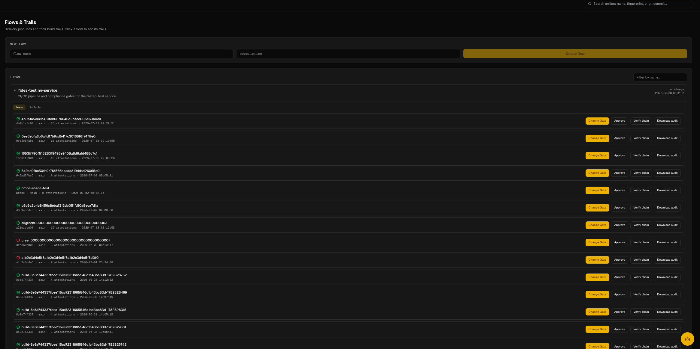
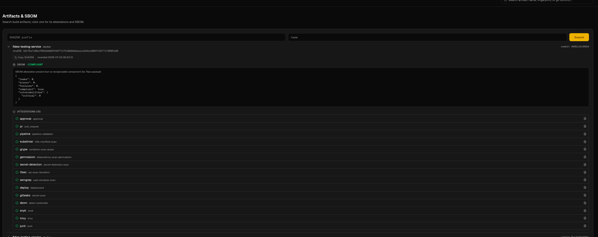
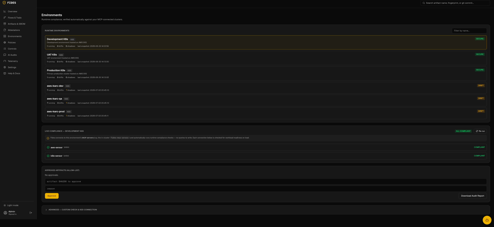
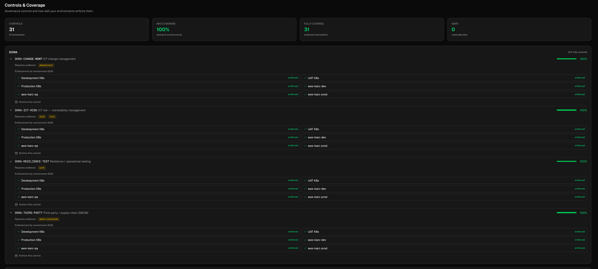
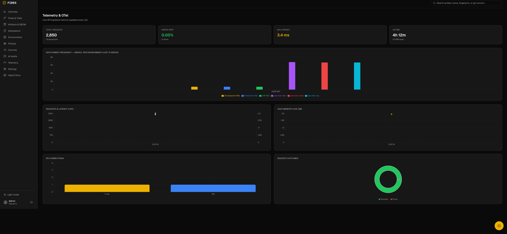
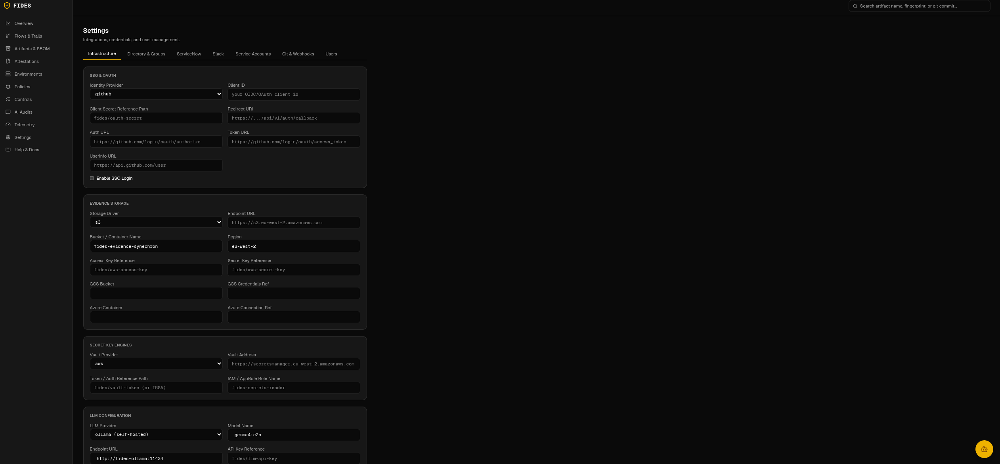
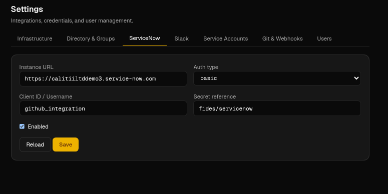
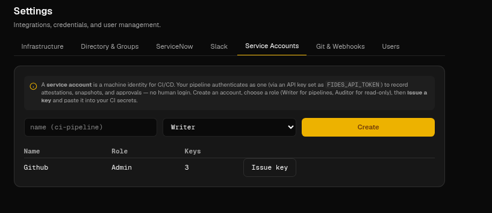
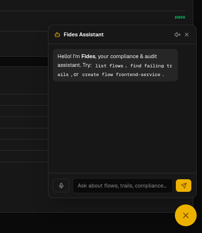

# Fides: Trust, Provenance & Evidence Tracking System

Fides (named after the Roman goddess of trust and oaths) is a self-hosted, multi-cloud compatible compliance tracking system. It records and evaluates every state change in the software delivery lifecycle (SDLC) in real-time, acting as an audit-ready single source of truth to satisfy strict compliance frameworks such as SOC 2, ISO 27001, and FDA 21 CFR Part 11.

For detailed architecture diagrams, database schemas, and integration designs, see the **[architecture_proposal.md](file:///mnt/data/Source-home/Calitti/evidance-vault/architecture_proposal.md)** document.

---

## Core Features

* **Supply Chain Provenance**: Statically compile and trace artifacts by their cryptographic SHA256 digest, verifying the path from Git commits to running runtimes.
* **Evidence Vault**: Secure and immutable storage for external scans (SBOM, CVE reports, log files) using local folders or cloud providers (S3, GCS, Azure Blob).
* **Pluggable Secrets & Vaults**: Start dynamically using environment configurations or query credentials directly from HashiCorp Vault, AWS, GCP, and Azure.
* **LLM Auditing Gateway (`Fides-AI`)**: Out-of-the-box support for verifying compliance against natural language parameters using Ollama, llama.cpp, and Google Gemini.
* **Drift & Shadow Change Detection**: Continuously monitor running containers or server state to find unauthorized shadow deployments and configuration drift.
* **FDA 21 CFR Part 11 Ready**: Built-in support for time-stamped system log tables, electronic records, and ECDSA signature validation for attestation logs.
* **Regulated Control Frameworks**: One-command adoption of SOC 2, ISO 27001, NIST 800-53, PCI-DSS, DORA, PSD2, and SOX control catalogs (`fides control import --framework`), with per-framework, audit-ready reports (`fides report --framework`) and coverage across environments.
* **Change Gate & Risk Scoring**: An evidence-backed approve/hold verdict with a 0–100 risk score for any change (`fides change-gate`), driven by which controls pass, fail, or lack evidence — and written back onto the matching **ServiceNow Change Request** (work note + risk field). Fides advises; ServiceNow decides.
* **Segregation of Duties**: First-class approval evidence (`fides approve`) distinguishing human sign-off from machine automation; four-eyes requires two distinct human approvers, and the change gate will not recommend approval without a human review.
* **Tenant Isolation (RLS)**: Defense-in-depth Postgres Row-Level Security enforced at the database layer — the app runs as a least-privilege role so a tenant only ever sees its own data (`FIDES_RLS_ENABLED`).
* **WORM Evidence Retention**: Optional S3 Object Lock retention so stored evidence is immutable for a fixed window (`FIDES_OBJECT_LOCK_MODE` + `FIDES_EVIDENCE_RETENTION_DAYS`) — for DORA/SOX.
* **Git Providers**: Commit-status checks and signed inbound push webhooks for **GitHub, GitLab, Bitbucket, and Azure DevOps**.
* **Easy Install**: A Helm chart (`charts/fides`) with a one-step seed job, or `scripts/setup-db.sh` — see [docs/setup.md](docs/setup.md).

---

## Project Structure

* `cmd/server/`: The entry point for the REST API backend.
* `cmd/cli/`: Statically compiled cross-platform CLI tool for macOS, Windows, and Linux.
* `pkg/models/`: Struct mapping PostgreSQL tables.
* `pkg/storage/`: Pluggable storage providers (local folder filesystem, AWS S3, etc.).
* `pkg/vault/`: Pluggable secrets vault interfaces.
* `pkg/policy/`: Compliance policy checking engine using JQ expressions.
* `pkg/ai/`: Artificial Intelligence gateway client supporting Ollama, llama.cpp, and Gemini.
* `pkg/api/`: REST server routers, request validators, and HTTP controllers.

---

## Quick Start

1. Start the backend database, MinIO object store, and Ollama engine:
   ```bash
   docker compose up --build -d
   ```
2. Build the server, CLI, and MCP binaries locally:
   ```bash
   go build -o fides-server cmd/server/main.go
   go build -o fides cmd/cli/main.go
   go build -o fides-mcp cmd/mcp/main.go
   ```
3. Initialize the database schema:
   ```bash
   psql -h localhost -U veritrail_user -d veritrail -f schema.sql
   ```
4. Read the **[getting_started.md](file:///mnt/data/Source-home/Calitti/evidance-vault/getting_started.md)** guide to set up Fides gates inside **GitHub Actions** and **GitLab CI/CD**.

---

## Model Context Protocol (MCP) Server

Fides includes a built-in Model Context Protocol (MCP) server `fides-mcp` that exposes compliance monitoring, pipeline flows, policies, artifacts, attestations, controls coverage, and deployment metrics as LLM-executable **tools** — and the Fides documentation as MCP **resources** (`fides://docs/*`) that an assistant can read on demand. It integrates with **Claude Code**, Claude Desktop, Cursor, and other AI clients for conversational interaction with your builds, audits, and pipelines. The binary is also shipped in the server image at `/usr/local/bin/fides-mcp`. See the full guide: [mcp-server.md](mcp-server.md).

### Configuration for Claude Desktop
Add the following configuration to your `claude_desktop_config.json` (located at `~/.config/Claude/claude_desktop_config.json` on Linux/macOS or `%APPDATA%\Claude\claude_desktop_config.json` on Windows):

```json
{
  "mcpServers": {
    "fides-mcp": {
      "command": "/absolute/path/to/fides-mcp",
      "env": {
        "FIDES_SERVER_URL": "http://localhost:8191"
      }
    }
  }
}
```

### Supported Tools
- `list_flows`: Retrieve details and status of all pipeline flows.
- `list_environments`: List runtime environment snapshots, active services, and drifts.
- `list_policies`: Fetch compliance policies and JQ release gate rules.
- `check_compliance`: Query policies compliance validation status for a specific artifact signature SHA256.
- `create_flow`: Converse with LLM to register new pipeline flow streams.
- `create_trail` / `report_artifact` / `report_attestation`: Programmatic inputs to register pipeline activities and evidence.


## Web Portal Tour

Fides ships a premium web portal for security auditors and DevSecOps controllers.
Below is a tour of the portal pages. A light/dark theme toggle lives in the sidebar;
the screenshots below use dark mode.

### 1. Overview Dashboard
Real-time compliance status: **clickable KPI cards** (Tracked Artifacts, Compliance
Pass %, Active Alerts, AI Evaluations), workload environment health, a live audit-log
trail, per-framework controls coverage, and ServiceNow / webhook integration events.


### 2. Flows & Trails
Delivery pipelines (**Flows**) and their build **Trails**. Expand a flow to see each
trail's attestation count and act on it — **Change Gate**, **Approve**, **Verify chain**,
or **Download audit**.


### 3. Artifacts, SBOM & Attestation drill-down
Search build artifacts by SHA256 and drill into an artifact's **SBOM** (CycloneDX / SPDX /
Syft components, licenses, vulnerabilities) and its full set of signed **attestations**.


### 4. Attestations
Every piece of evidence recorded against build trails, with compliance status, evidence
type, and totals — filterable by name, type, and compliance.


### 5. Environments & MCP Connections
Monitor runtime environments (EKS / ECS) with running / drift / shadow counts, and let
Fides run **live compliance checks** against each environment's **MCP sensors** (e.g. the
in-cluster `fides-mcp-sensor`) — plus per-environment artifact allow-lists.


### 6. Policies Editor (Monaco + AI)
Author deterministic JQ compliance gates in a full **Monaco editor** with **Format** and an
AI **"Check & fix"** action, or generate rules from a described goal with the LLM Policy Wizard.


### 7. Controls & Coverage
Adopt regulated frameworks (SOC 2, ISO 27001, NIST 800-53, PCI-DSS, DORA, PSD2, SOX) and see
coverage **grouped by framework**, with average coverage and gaps at a glance.


Drill into any control to see the evidence it requires and its **per-environment
enforcement**, with one-click actions to enforce or archive it.


### 8. AI Audits & LLM Evaluator Reports
Deep, **parsed and scored** risk / compliance assessments generated by local or cloud LLMs
for every reported attestation — vulnerabilities, failures, licensing risks, and an overall score.


### 9. Telemetry & OpenTelemetry Metrics
Live API backend observability — request / error rates, latency, DB connection pools, request
outcomes — plus **DORA weekly deployment frequency per environment**. Export to Prometheus
`/metrics` or OpenTelemetry.


### 10. Settings — Infrastructure
Configure SSO / OAuth, the evidence storage driver (S3 / GCS / Azure / local), the secrets
vault (AWS / Vault / …), and the LLM provider — all by **secret reference**, never raw secrets.


### 11. Settings — Directory & SSO Group Mappings
Map identity-provider groups (GitHub teams, GitLab groups, Okta claims) to Fides roles so
access is managed centrally in your directory instead of per-user.


### 12. Settings — Integrations (ServiceNow, Git & Webhooks, Service Accounts)
Wire the change-gate write-back to **ServiceNow**, connect **Git providers** for commit-status
checks + signed inbound webhooks, and issue **service-account** API keys for CI/CD.




### 13. AI Assistant (voice-enabled)
A built-in AI Assistant with **voice input and spoken replies**, backed by the same Fides
tools exposed through in-browser WebMCP so agents can act inside the authenticated session.

